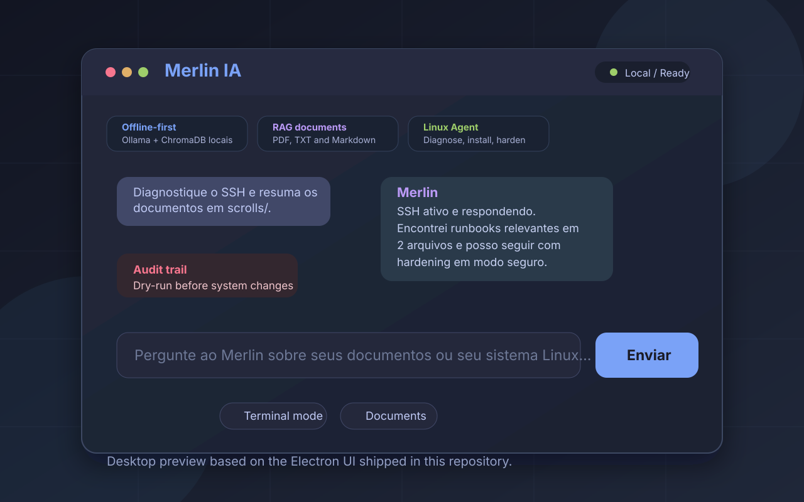
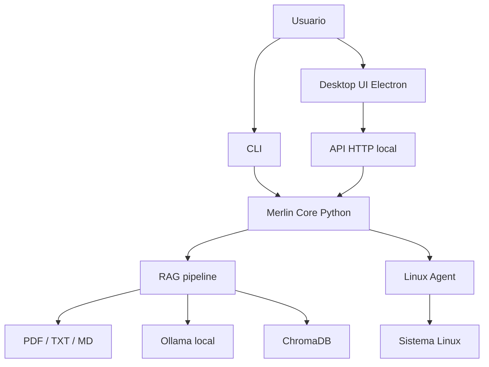

# 🧙 Merlin IA




**Seu assistente Linux inteligente e 100% privado.**

O Merlin IA é um assistente local-first para Linux que combina RAG em documentos, automação de sistema e interface desktop/CLI sem enviar dados para serviços externos.

## Visão Rápida

- IA local com `Ollama` + `ChromaDB`.
- Consulta a `PDF`, `TXT` e `Markdown` via RAG.
- Automação Linux com diagnóstico, instalação, hardening e lockdown.
- Uso por `CLI`, app desktop `Electron` e API HTTP local.
- Distribuição real com instaladores `.deb`, `.rpm`, `.dmg`, `.exe` e `AppImage`.

## Case Summary

- Problema: consultar documentação privada e automatizar rotinas operacionais sem depender de nuvem.
- Solução: um único core Python com RAG, Linux Agent e múltiplas superfícies de uso.
- Relevância técnica: demonstra backend local, integração com sistema operacional, IA aplicada, packaging e documentação de produto.

## Casos de Uso Reais

- Base de conhecimento privada para manuais, runbooks e documentação interna.
- Diagnóstico assistido e troubleshooting de serviços Linux.
- Automação local de setup, instalação de pacotes e hardening.
- Assistente técnico para times ou ambientes com requisitos fortes de privacidade.

## Arquitetura



## Stack / Componentes

| Camada | Tecnologias / responsabilidade |
| --- | --- |
| Core | `Python 3.8+`, orquestração do assistente, CLI e regras de execução |
| API local | `Flask` + `Flask-CORS` para integrar UI desktop e automações locais |
| IA / Conhecimento | `Ollama`, `ChromaDB`, embeddings e pipeline RAG |
| Desktop | `Electron` com UI simples e focada em chat operacional |
| Automação | Linux Agent, dry-run, auditoria e ações de hardening |
| Packaging | `electron-builder` para `.deb`, `.rpm`, `.dmg`, `.exe` e `AppImage` |
| Qualidade | `91` testes versionados + documentação técnica de instalação, API e build |

## Status do Projeto

| Área | Estado atual | Evidência |
| --- | --- | --- |
| RAG em documentos locais | ✅ Implementado | indexação incremental e recuperação contextual |
| Linux Agent | ✅ Implementado | diagnose, install, harden e lockdown |
| Interfaces | ✅ CLI + Electron + API local | mesmo core Python exposto em múltiplas entradas |
| Packaging | ✅ Disponível | build para Linux, Windows e macOS |
| Testes | ✅ 91 testes | suíte `unit` e `integration` no repositório |

## Instalação Rápida (Ubuntu/Debian)

```bash
# Baixe o .deb da última release
gh release download --repo N1ghthill/merlin-ia --pattern '*.deb'

# Instale
sudo dpkg -i merlin-ia_*_amd64.deb

# Execute
merlin-ia
```

Outros formatos: Windows (`.exe`), macOS (`.dmg`), Linux (`.rpm` e `AppImage`) em [Build do Zero](./docs/build-do-zero.md).

## Como Funciona

1. Adicione seus documentos na pasta `scrolls/`.
2. O Merlin indexa o conteúdo e gera embeddings localmente.
3. A pergunta entra pelo CLI ou pela UI desktop.
4. O RAG recupera os trechos relevantes e o Merlin responde com contexto.
5. Se necessário, o Linux Agent executa ações operacionais no sistema.

## Comandos do Linux Agent

Digite estes comandos diretamente no chat:

- `/linux-diagnose ssh 50` para diagnóstico detalhado do serviço SSH.
- `/linux-install nginx` para instalação de pacote com fluxo seguro.
- `/linux-harden ssh` para aplicar configurações de hardening no SSH.
- `/linux-lockdown` para ativar modo de proteção com superfície reduzida.

## Avaliação Técnica Rápida

Para um recrutador ou engenheiro técnico, estes pontos dão a leitura mais rápida do projeto:

- [Case do projeto](./docs/case.md)
- [Guia de instalação](./docs/01-instalacao.md)
- [Como usar](./docs/02-como-usar.md)
- [Comandos do Linux Agent](./docs/18-merlin-cli-commands.md)
- [API local](./docs/api.md)
- [Build e empacotamento](./docs/build-do-zero.md)
- [Suíte de testes](./tests)

## Para Desenvolvedores

```bash
git clone https://github.com/N1ghthill/merlin-ia.git
cd merlin-ia
python3 -m venv .venv
source .venv/bin/activate
pip install -r requirements.txt -r requirements-dev.txt

# Rodar testes
pytest tests/ -v

# Rodar UI desktop
cd electron
npm install
npm start

# Gerar pacote .deb
npm run dist:deb
```

## Contribuindo

Contribuições em código, documentação e validação de ambientes são bem-vindas. O fluxo inicial está em [CONTRIBUTING.md](./CONTRIBUTING.md).

## Licença

MIT - use, modifique e compartilhe livremente.

## Contato

Para oportunidades ligadas a automação inteligente, agentes locais e produtos com privacidade forte: `irving@ruas.dev.br`.
