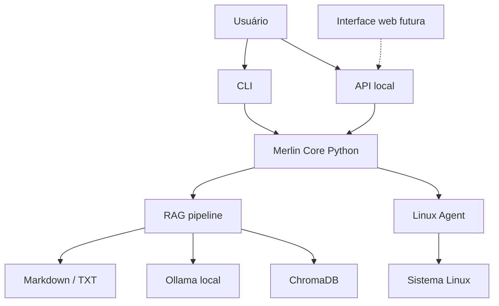

# Merlin IA


Assistente local-first para Linux com RAG em documentos, CLI, API HTTP local e um Linux Agent com execução controlada.

## Resumo

- Core Python único para CLI, API local e indexação RAG.
- Respostas locais com `Ollama` + `ChromaDB` sobre arquivos `Markdown` e `TXT`.
- Linux Agent opcional com `dry-run`, confirmação explícita, ACL e auditoria.
- Foco atual em uso local via CLI e API. A futura interface web deve consumir a API já existente.
- Persistência configurável por modo de armazenamento e variáveis de ambiente.

## O Que Este Repositório Demonstra

- Assistente local-first voltado para privacidade e uso em Linux.
- Separação clara entre chat, recuperação de contexto e execução operacional.
- Camada estável de integração via API HTTP local.
- Projeto Python empacotável com CLI, testes versionados e documentação operacional.

## Casos de Uso

- Consulta privada de documentação técnica, runbooks e notas internas sem enviar dados para terceiros.
- Assistente local para troubleshooting e diagnóstico operacional em hosts Linux.
- Base local de conhecimento para times que precisam combinar RAG com automação controlada.
- Contrato de backend para uma futura interface web sem duplicar a lógica de negócio no frontend.

## Arquitetura



## Setup Rápido

```bash
git clone https://github.com/N1ghthill/merlin-ia.git
cd merlin-ia

sudo apt install -y python3 python3-pip python3-venv

python3 -m venv .venv
source .venv/bin/activate
pip install --upgrade pip
pip install -r requirements.txt -r requirements-dev.txt
pip install -e .
ollama pull qwen2.5:7b
```

## Comandos Principais

```bash
source .venv/bin/activate
merlin-ia
merlin-api --port 3030
merlin-index
```

## Fluxo de Uso

1. Inicie o CLI com `merlin-ia`.
2. Rode `/paths` para ver diretórios ativos de `scrolls`, histórico e índice.
3. Adicione arquivos `.md` e `.txt` ao diretório `scrolls_dir`.
4. Faça a pergunta no terminal.
5. Se quiser forçar reindexação, use `/index_scrolls` ou `merlin-index`.

Comandos úteis no CLI:

- `/help`
- `/paths`
- `/profile`
- `/set <chave> <valor>`
- `/index_scrolls`
- `/reindex`
- `/linux-diagnose ssh 50`
- `/linux-install nginx`

## Persistência e Paths

O Merlin escolhe o modo de armazenamento em runtime:

- Em um clone Git gravável, tende a usar `project`, mantendo dados em `./data` e documentos em `./scrolls`.
- Fora desse cenário, usa `user`, com paths XDG em `~/.local/share/merlin-ia` e `~/.local/state/merlin-ia`.
- Você pode fixar o comportamento com `MERLIN_STORAGE_MODE=project` ou `MERLIN_STORAGE_MODE=user`.
- Também é possível sobrescrever caminhos individualmente com `MERLIN_SCROLLS_DIR`, `MERLIN_HISTORY_PATH`, `MERLIN_CHROMA_DIR` e variáveis correlatas.

O comando `/paths` expõe os caminhos realmente ativos na sessão.

## Linux Agent

O executor Linux é opcional e vem desligado por padrão.

```bash
export MERLIN_ENABLE_EXECUTOR=1
merlin-ia
```

O fluxo de escrita continua protegido:

- `dry-run` antes de executar
- confirmação explícita
- ACL
- log de auditoria

## Qualidade

- Repositório com 91 testes versionados.
- Workflow do GitHub Actions executa a suíte versionada em `tests/`.
- `make compile` valida a compilação dos módulos Python.

## Estrutura do projeto

- `merlin_cli.py`: entrada principal do CLI.
- `merlin_api.py`: API HTTP local.
- `rag_indexer.py`: reindexação completa do RAG.
- `merlin/`: paths, handlers e integração com o Linux Agent.
- `executor/`: executor Unix socket com validação, ACL e auditoria.
- `scripts/`: atalhos de execução para desenvolvimento local.
- `docs/`: instalação, uso, API e documentação operacional.

## Documentação Essencial

- [Índice da documentação](./docs/README.md)
- [Case técnico](./docs/case.md)
- [Arquitetura](./docs/arquitetura.md)
- [Instalação](./docs/01-instalacao.md)
- [Como usar](./docs/02-como-usar.md)
- [API local](./docs/api.md)
- [Comandos do CLI](./docs/18-merlin-cli-commands.md)
- [Linux Agent](./docs/04-linux-agent-executor.md)

## Contribuindo

O fluxo base está em [CONTRIBUTING.md](./CONTRIBUTING.md).

## Licença

MIT.
