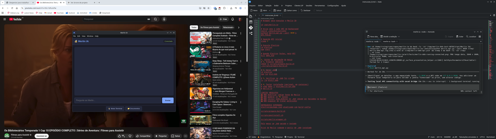

# 🧙 Merlin IA

**Assistente local com RAG para Linux**  
*Chat com seus documentos, anotações e sistema - tudo local e privado*



## ✨ O que é?

Merlin IA é um assistente inteligente que roda **100% local** no seu computador. Ele:
- 📚 **Lê seus documentos** (PDF, TXT, MD) e conversa sobre eles
- 🐧 **Gerencia seu Linux** (diagnóstico, instalação, hardening)
- 🖥️ **Interface nativa** (Electron) + CLI poderoso
- 🔒 **Privacidade total** (nada sai da sua máquina)

## 🚀 Instalação Rápida (Ubuntu/Debian)

```bash
# Baixe o .deb da última release
wget https://github.com/N1ghthill/merlin-ia/releases/latest/download/merlin-ia_0.1.0_amd64.deb

# Instale
sudo dpkg -i merlin-ia_0.1.0_amd64.deb

# Execute
merlin-ia
```

## 📦 Outros formatos

- Windows: `npm run dist:win` (gera `.exe`)
- macOS: `npm run dist:mac` (gera `.dmg`)
- Linux (RPM): `npm run dist:rpm`

## 🧪 Status do Projeto

| Componente | Status | Cobertura |
| --- | --- | --- |
| RAG Core | ✅ Estável | 93% |
| Linux Agent | ✅ Robusto | 68% |
| CLI | ✅ Completo | 71% |
| Electron UI | ✅ Nova | - |
| Total | **91 testes** | **Média 77%** |

## 📚 Documentação Completa

- [Guia de Instalação](docs/01-instalacao.md)
- [Como Usar](docs/02-como-usar.md)
- [Comandos do Linux Agent](docs/18-merlin-cli-commands.md)
- [API para Desenvolvedores](merlin_api.py)
- [Build do Zero](instrucoes_8.md)
- [Contribuindo](CONTRIBUTING.md)

## 🧠 Como Funciona

1. Você adiciona documentos em `scrolls/`
2. Merlin indexa e transforma em embeddings (via Ollama + ChromaDB)
3. Você pergunta algo na UI ou CLI
4. Merlin busca trechos relevantes e gera resposta contextualizada

## 🐧 Linux Agent

Comandos mágicos direto no chat:

```bash
/linux-diagnose ssh 50    # Diagnóstico do serviço SSH
/linux-install nginx      # Instala Nginx (com dry-run)
/linux-harden ssh         # Aplica hardening no SSH
/linux-lockdown           # Modo read-only
```

## 🛠️ Desenvolvimento

```bash
git clone https://github.com/N1ghthill/merlin-ia.git
cd merlin-ia
python3 -m venv .venv
source .venv/bin/activate
pip install -r requirements.txt
pip install -r requirements-dev.txt

# Rodar testes
pytest tests/ -v

# Gerar .deb
cd electron && npm run dist:deb
```

## 🤝 Contribuindo

Pull requests são bem-vindos. Leia [CONTRIBUTING.md](CONTRIBUTING.md) para começar.

## 📜 Licença

MIT - use, modifique, compartilhe.

## 🧙 Feito com magia por N1ghthill
